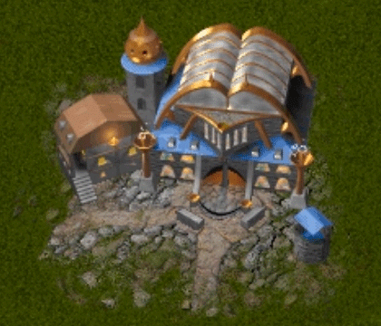

# Construções
{: .no_toc }

Esta página descreve as construções de Rising Lands.

--------------------------------------------------------------------------------

  

    Contents
  

  {: .text-delta }
1. TOC
{:toc}



--------------------------------------------------------------------------------

## Farol

## Caserna

## Santuário

|  |
| :--------------------------: |
|          Santuário           |

> SANTUÁRIO
>
> DESCRIÇÃO
>
> Custo .........	Comida: 50	Pedras: 30
> Capacidade...	16
>
> FUNÇÃO: O Santuário é muito procurado como um ponto de encontro para o seu clã.
> As salas espaçosas podem abrigar um grande número de Colonizadores, com uma
> sala de aula que permite transformar estes Colonizadores em Fazendeiros,
> Construtores ou Mecânicos. O Santuário é vasto e necessita de constantes
> reparos. Por essa razão, e pelo fato de que maior número de membros do clã
> significa uma maior produtividade, nós recomendamos encher o Santuário com o
> maior número possível de Colonizadores. Existe também uma sala de conferências
> para negociações diplomáticas, onde tratados entre clãs são assinados e
> oficialmente selados.
>
> RUMORES CIRCULANTES SOBRE O SANTUÁRIO
>
> Construído para durar, o Santuário contém todo o conforto moderno - quartos
> individuais, água quente e o melhor sistema de aquecimento disponível.
> Colonizadores se encontram no Grande Salão para debater os editais passados
> pelo seu Grande Líder. Há rumores de que lá haja um destilador alcoólico, e que
> apenas os iniciados (a Fraternidade da Destilaria) pode dividir as bebidas.
> Para descobrir os prazeres do destilador, iniciantes devem passar por uma
> iniciação rigorosa para provar sua fidelidade. Essa tradição, entretanto, é
> desprezada, pois o doce licor afeta adversamente o comportamento dos
> Colonizadores e causa insubordinação.
>
> — *manual do jogo*

{{ top }}

## Armazém
## Cultura
## Oficina
## Biblioteca
## Laboratório
## Hangar
## Muro
## Catapulta
## Canhão
## Elevadiça
## Circo
## Garagem
## Monastério

|     |
| :------------------------------: |
| Monastério e Monastério de Fusão |

> TEMPLO
>
> DESCRIÇÃO:
>
> Custo		Comida: 20	Pedras: 4	Capacidade...	6
>
> FUNÇÃO: Estudantes estudam no Templo para se tornar Druidas e dominar os
> segredos do Cristal. Mantenha em mente que os Druidas necessitam de um Cristal
> para recarregar sua Mana.
>
> RUMORES CIRCULANTES A RESPEITO DO TEMPLO
>
> O Templo é banhado em uma semipenumbra, como Cristal no centro iluminando a
> estrutura circular. A cerimônia de iniciação dos Novos Druidas é absolutamente
> espetacular. Eles devem se prostrar ante o Cristal, gotas de Cristal pingando
> sobre seus corpos até estarem completamente encharcados. Um halo de luz
> forma-se então ao seu redor e seus olhos assumem uma coloração azul
> cristalina. Após esse rito de passagem para o reino espiritual, o noviço é
> novamente encharcado, mas desta vez nos prazeres de uma bebida inebriante
> passando por suas veias até que ele se torne inconsciente na Fonte do
> Cristal...
>
> — *manual do jogo*

O Monastério...

> TEMPLO DE FUSÃO
>
> DESCRIÇÃO:
>
> Custo		Comida: 20	Pedras: 4 Capacidade...	6
>
> O Templo de Fusão é um grande avanço em relação ao Templo comum. Logo que você
> descobrir o processo de Fusão, você pode transformar seu Templo em um Templo
> de Fusão. Selecione o Templo e clique no ícone de Melhoramento.
>
> FUNÇÃO: O Templo de Fusão permite que você lance uma SUPER NOVA, se seu clã
> possuir os feitiços correspondentes. O esquema para a construção deste
> edifício requer muita pesquisa no campo de Religião e Magia.
>
> RUMORES CIRCULANTES SOBRE O TEMPLO DE FUSÃO
>
> A comunidade religiosa considera o Templo de Fusão a experiência definitiva.
> Ele atingiu status de cuIt por excelência logo após sua construção, pois
> apenas os melhores materiais foram empregados para tal. Os Druidas que lá
> habitam instalaram uma máquina de ventilação movida a energia solar, para
> fornecer condicionamento de ar. Os Druidas gravam seus cânticos em um estúdio
> de som altamente secreto, escondido nas profundezas do abrigo subterrâneo.
> Essas rapsódias melódicas flutuam pelo ar da noite, trazendo sonhos doces e
> pura tranqüilidade para as almas dos que descansam… Os transeuntes que chegam
> a ouvir a música na escuridão profunda são lembrados de um paraíso perdido,
> embora não saibam a razão....
>
> — *manual do jogo*

O Monastério de Fusão...

| <video autoplay muted loop playsinline controls><source src="https://raw.githubusercontent.com/nelsonspbr/nelsonspbr.github.io/master/games/rising/videos/supernova.mp4" type="video/mp4"></video> |
| :------------------------------------------------------------------------------------------------------------------------------------------------------------------------------------------------: |
|                                                                             Supernova lançada pelo Monastério de Fusão                                                                             |

## Mercado
## Cristal
## Heliporto
## Hospital
## Barraca de Campanha
