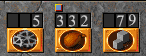
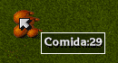
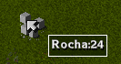
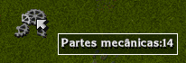
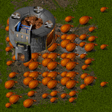
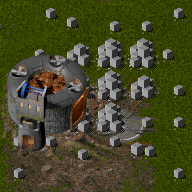
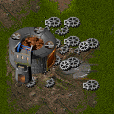

# Visão Geral
{: .no_toc }

Esta página descreve um pouco os comandos e mecânicas gerais de Rising Lands.

 

  

    Contents
  

  {: .text-delta }
1. TOC
{:toc}



--------------------------------------------------------------------------------

## Movimentação e Ações
<a href="#" id="back-to-top">🔝</a>

- A movimentação de unidades é feita através do mouse. Unidades e construções
  são selecionadas com um clique do botão esquerdo do mouse. Com uma unidade
  selecionada, um clique simples no mapa faz com que a unidade mova até o ponto
  indicado.

- Dois cliques em uma unidade fazem com que esta deixe quaisquer recursos sendo
  carregados no chão (e.g., Fazendeiro, Construtor, Mecânico). No caso de um
  veículo todos os ocupantes do mesmo são ejetados. No caso de uma construção um
  Colono é ejetado.

- Quando apenas unidades militares estão selecionadas, posicionar o mouse sobre
  uma unidade de outro clã (aliado ou inimigo) muda o cursor para o de ataque.
  Cuidado para não atacar uma unidade aliada sem querer! Também é possível
  atacar unidades e pontos aleatórios do mapa segurando a tecla ALT. No caso de
  construções, apenas no caso de construções inimigas o cursor muda
  automaticamente para o de ataque. Para atacar intencionalmente uma construção
  aliada é necessário usar a tecla ALT.

- É possível agrupar unidades usando a tecla CTRL e um número de 1 a 9.
  Posteriormente é possível selecionar estas unidades teclando o número
  correspondente.

- É possível mover a tela tanto com o mouse quanto com o teclado. O mini-mapa
  também pode ser usado para navegar. É possível esconder/mostrar o mini-mapa
  teclando TAB.

- Construtores podem tanto iniciar uma construção como retomá-la. Vários
  Construtores podem participar da mesma obra, acelerando a construção da mesma.

  | <video autoplay muted loop playsinline controls><source src="https://raw.githubusercontent.com/nelsonspbr/nelsonspbr.github.io/master/games/rising/videos/construtores-construindo.mp4" type="video/mp4"></video> |
  | :---------------------------------------------------------------------------------------------------------------------------------------------------------------------------------------------------------------: |
  |                                                                                             Construtores construindo                                                                                              |

- Construções podem ser demolidas. Ao fazê-lo você irá recuperar metade dos
  recursos gastos na construção. Isso é particularmente útil em missões com
  escassez de recursos e/ou impossibilidade de coletar mais recursos, como nas
  missões 8, 17, e 23. Para demolir uma construção basta segurar a tecla DELETE
  e clicar na construção. Note que as unidades dentro da construção irão sofrer
  danos — talvez seja uma boa idéia deixar apenas um Colono dentro da construção
  antes de demolí-la.

  | <video autoplay muted loop playsinline controls><source src="https://raw.githubusercontent.com/nelsonspbr/nelsonspbr.github.io/master/games/rising/videos/demolir.mp4" type="video/mp4"></video> |
  | :----------------------------------------------------------------------------------------------------------------------------------------------------------------------------------------------: |
  |                                                                                       Construção demolida                                                                                        |

- Construtores podem reparar edifícios danificados. Os reparos são gratuitos,
  isto é, não consomem recursos de jogo.

  | <video autoplay muted loop playsinline controls><source src="https://raw.githubusercontent.com/nelsonspbr/nelsonspbr.github.io/master/games/rising/videos/construtores-reparando.mp4" type="video/mp4"></video> |
  | :-------------------------------------------------------------------------------------------------------------------------------------------------------------------------------------------------------------: |
  |                                                                                             Construtores reparando                                                                                              |

- De maneira similar, Mecânicos podem reparar veículos danificados. É possível
  usar vários Mecânicos parar reparar um mesmo veículo. Há uma limitação,
  contudo, já que Mecânicos só podem reparar até 50% dos pontos de vida da
  unidade. Para reparar um veículo completamente é necessário levá-lo até uma
  Garagem.

  | <video autoplay muted loop playsinline controls><source src="https://raw.githubusercontent.com/nelsonspbr/nelsonspbr.github.io/master/games/rising/videos/reparo-half-full.mp4" type="video/mp4"></video> |
  | :-------------------------------------------------------------------------------------------------------------------------------------------------------------------------------------------------------: |
  |                                                                                            Mecânicos reparando                                                                                            |

## Recursos

> Em Rising Lands não existe dinheiro. A única forma de intercâmbio monetário é
> feita com os Recursos disponíveis, que podem ser de três tipos. Estes são
> essenciais, mas raros: você deve administrá-los astutamente ou arcar com as
> conseqüências. Você pode estocá-los, trocá-los ou roubá-los durante o jogo:
>
> - Comida - colhida nos campos pelo Fazendeiro, ela alimenta sua população e
>   leva colonizadores errantes de volta ao seu núcleo. Além disso, ela vai
>   ajudá-lo a levar a cabo seus planos de construção (veículos e edificações) e
>   de treinamento dos seus Colonizadores.
>
> - Pedras - o Construtor pode extrair Pedras das minas localizadas embaixo das
>   montanhas e então usá-las para construir edificações.
>
> - Restos de Metal - Restos de Metal da antiga civilização podem ser
>   encontrados em toda a parte. Mecânicos podem recolhê-los e usá-los na
>   construção de veículos.

<i>— manual do jogo</i>

Como todo bom jogo de estratégia, os recursos em Rising Lands são fundamentais
para construir suas bases e treinar unidades. Rising Lands define três recursos:

- **Comida**: Usada em praticamente toda construção e unidade do jogo;
- **Pedras**: Usadas principalmente em construções; e
- **Partes Mecânicas**: Usadas para treinar veículos na Oficina e no Heliporto.

A quantidade de cada um destes disponível para construir edifícios e treinar
unidades é indicada no canto inferior direito da tela, conforme exemplo abaixo.
Neste exemplo tenho 5 Partes Mecânicas, 1332 Comidas (o bloco azul logo acima
do número é um indicador de milhares), e 79 Pedras.

|               |
| :-----------------------------------: |
| Recursos do jogo disponíveis para uso |

É possível encontrar estes recursos no chão, conforme os exemplos abaixo:

|  |  |  |
| :--------------------------: | :--------------------------: | :-----------------------------: |
|        Comida no chão        |        Pedras no chão        |    Partes Mecânicas no chão     |

Mas o ideal é trazer estes recursos para um Armazém — só assim o recurso é
contabilizado nos estoques do seu clã. Os exemplos abaixo mostram Armazéns com
excesso de recursos, apenas para fins ilustrativos.

|  |  |  |
| :-----------------------------: | :-----------------------------: | :--------------------------------: |
|       Armazém com Comida        |       Armazém com Pedras        |    Armazém com Partes Mecânicas    |

## Coleta de Recursos

Cada recurso é coletado por unidades específicas:

- **Comida**: Fazendeiro (Santuário) e Ceifeiro (Oficina);
- **Pedras**: Construtor (Santuário); e
- **Partes Mecânicas**: Mecânico (Santuário).

A coleta em si é feita utilizando o mouse e a tecla CTRL. Basta clicar na
unidade e, mantendo a tecla CTRL pressionada, clicar na origem do recurso, e
posteriormente no destino. Os exemplos abaixo mostram esse processo.

| <video width="100%" autoplay muted loop playsinline controls><source src="https://raw.githubusercontent.com/nelsonspbr/nelsonspbr.github.io/master/games/rising/videos/coleta-comida.mp4" type="video/mp4"></video> |
| :-----------------------------------------------------------------------------------------------------------------------------------------------------------------------------------------------------------------: |
|                                                                                                  Coleta de Comida                                                                                                   |

| <video width="100%" autoplay muted loop playsinline controls><source src="https://raw.githubusercontent.com/nelsonspbr/nelsonspbr.github.io/master/games/rising/videos/coleta-pedras.mp4" type="video/mp4"></video> |
| :-----------------------------------------------------------------------------------------------------------------------------------------------------------------------------------------------------------------: |
|                                                                                                  Coleta de Pedras                                                                                                   |

Tipicamente isso é feito com o destino sendo um Armazém ou Cultura. Algumas
observações pertinentes:

- Comida e Pedras podem ser coletadas tanto do chão quanto de suas fontes
  específicas (Vegetais e Minas, respectivamente).

- Vegetais brotam próximos a uma Abóbora, conforme mostrado no vídeo. Leva um
  tempo até que os Vegetais brotem novamente, o que sugere a necessidade de
  manter diversos pontos de coleta de Comida para manter um fluxo de entrada
  saudável.

- Diferente de Vegetais (e portanto de Comida), Minas e Partes Mecânicas são
  recursos finitos em um mapa. É raro em um jogo da campanha ficar sem Pedras,
  mas Partes Mecânicas são esparsamente distibuídas pelo mapa. O Mecânico é uma
  unidade rápida, o que é uma forma de tentar compensar esse fato. Contudo, é
  importante ter Mecânicos buscando Partes Mecânicas pelo mapa e também
  coletando quaisquer partes deixadas por veículos destruídos em combate.

- Armazéns tem uma capacidade finita. Para conseguir estocar mais recursos é
  necessário construir mais Armazéns.

## População

O Colono é a base da população do jogo. Qualquer unidade (com a exceção das
unidades do Heliporto) treinada posteriormente "consome" um Colono no processo.
Isto é, para treinar um Fazendeiro no Santuário ou um Incendiário na Caserna é
necessário que a construção esteja populada por pelo menos um Colono e esse
Colono será "consumido" no treinamento. Essa é uma mecânica peculiar de Rising
Lands. Não me considero grande conhecedor de muitos jogos, mas diria que são
poucos os jogos que tem uma mecânica do tipo.

O treinamento do Colono é baseado no depósito de Comida na Cultura. O vídeo
abaixo mostra um exemplo de uma Cultura populada por um Colono (slots
verticais). Os slots horizontais são unidades de Comida. No exemplo a Cultura
deve ser preenchida por 3+1 Comidas para gerar um novo Colono, que
posteriormente pode ser retirado da Cultura e usado para outro fim.

| <video autoplay muted loop playsinline controls><source src="https://raw.githubusercontent.com/nelsonspbr/nelsonspbr.github.io/master/games/rising/videos/cultura-enchendo.mp4" type="video/mp4"></video> |
| :-------------------------------------------------------------------------------------------------------------------------------------------------------------------------------------------------------: |
|                                                                                         Recrutando novos Colonos                                                                                          |

Também é possível redefinir (*reset*) unidades, transformando-nas de volta em
Colonos. Isso é feito através do Santuário. Apenas unidades à pé podem passar
por esse processo — unidades montadas como o Dell'Orso e o Rhino não podem. O
exemplo abaixo mostra esse processo aplicado a um Soldado.

| <video autoplay muted loop playsinline controls><source src="https://raw.githubusercontent.com/nelsonspbr/nelsonspbr.github.io/master/games/rising/videos/reset-unit.mp4" type="video/mp4"></video> |
| :-------------------------------------------------------------------------------------------------------------------------------------------------------------------------------------------------: |
|                                                                                        Redefinindo unidades                                                                                         |

Por fim, vale notar que embora treinar unidades na Oficina consuma um Colono, o
Colono ainda "existe" e pode ser "acessado" (retirado do veículo) através de um
duplo-clique no veículo. Nessa mesma linha, também é possível colocar qualquer
unidade a pé para "pilotar" o veículo. Essas ações são mostradas no exemplo
abaixo.

| <video autoplay muted loop playsinline controls><source src="https://raw.githubusercontent.com/nelsonspbr/nelsonspbr.github.io/master/games/rising/videos/colono-veiculo.mp4" type="video/mp4"></video> |
| :-----------------------------------------------------------------------------------------------------------------------------------------------------------------------------------------------------: |
|                                                                                           Pilotando veículos                                                                                            |

## Unidades e Alimentação

<!-- TODO -->

- barra de espaço = stats
- barra de vida
- pontos de experiência
- pizza

> Unidades militares adquirem pontos de experiência, que aparecem na forma de
> pequenos triângulos junto ao gráfico de Comida.
> Uma unidade militar pode adquirir um máximo de 4 pontos de experiência:
>
> - nenhum triângulo: a unidade não possui pontos de experiência
> - 1 triângulo: maior força de ataque
> - 2 triângulos: armadura reforçada
> - 3 triângulos: perímetro de visão aumentado
> - 4 triângulos: consome menos Comida

<i>— manual do jogo</i>

Um comando que pode ser útil em algumas situações, é possível forçar que suas
unidades comam — desde que a pizza esteja pelo menos com um pedaço faltando.
Basta pressionar a tecla **E**. Isso por ajudar, por exemplo, quando você quiser
"sincronizar" a alimentação de um grupo de unidades antes de movê-las.

<!-- TODO: Adicionar vídeo disso -->

## Pesquisa Científica

<!-- TODO -->

- Agricultura
- Civil
- Militar
- Magia

## Grupo dos Assassinos

> Uma gangue de guerreiros assassinos, os membros da Liga dos Assassinos não se
> importam com nada... excetuando-se pilhagem. Eles nunca constroem vilas ou
> estabelecem campos. A Liga, entretanto, pode ser descompromissada em seus
> negócios por possuir um segredo que lhes dá acesso ao [...] mundo
> doente das Criaturas das Sombras. A melhor forma de livrar a terra de seu
> rastro pútrido é matá-los sem piedade.

<i>— manual do jogo</i>

O Grupo dos Assassinos (ou Liga dos Assassinos, ou ainda Confraria dos
Assassinos) aparece desde a primeira missão. São unidades com escudo preto que
aparecem de vez em quando aleatoriamente pelo mapa. Esse "aparecer" — *spawn*;
provavelmente vou usar esse termo aportuguesado em alguns momentos — é animado
com uma fumaça. Consegui capturar esse momento no exemplo abaixo.

| <video autoplay muted loop playsinline controls><source src="https://raw.githubusercontent.com/nelsonspbr/nelsonspbr.github.io/master/games/rising/videos/grupo-assassinos.mp4" type="video/mp4"></video> |
| :-------------------------------------------------------------------------------------------------------------------------------------------------------------------------------------------------------: |
|                                                                                     Grupo dos Assassinos *spawnando*                                                                                      |

Na missão 1 creio que apareçam apenas Soldados. Já na 2 começam a aparecer
Arqueiros. Não sei já na quarta missão aparecem Incendiários, mas com certeza a
partir da quinta eles aparecem. Esses grupos, tipicamente de 1-3 unidades, ou
irão alvejar um de seus Armazéns, ou uma unidade específica. É um inimigo que
atrapalha mais durante o começo do jogo, ou quando você tem uma expansão para
extração de recursos sem boas defesas. É importante sempre manter algumas
unidades militares protegendo suas unidades civis todo tempo.

## Criaturas das Sombras

> Um manuscrito antigo faz menção a um fenômeno bizarro que você irá certamente
> descobrir. O que se segue é uma evidência reveladora e apavorante...
>
> Para todos os cidadãos da terra - Por favor, permitam que me apresente. Sou um
> viajante solitário que está preste a sair em uma jornada da qual posso não
> voltar jamais. Deixarei este como um último testemunho, pois posso não voltar
> de onde estou indo para avisar os humanos deste grave perigo... De longe eu
> sinto uma fumaça acre, seu odor avisando-me que entrei na zona morta. Me
> aproximo com extremo cuidado e logo meus piores medos transformam-se em um
> grotesco pesadelo acordado... tudo é esquecimento... Corpos estão espalhados
> pelos fragmentos das ruínas, tão cortados e rasgados que se torna impossível a
> identificação. Mas uma pobre alma ainda vive, pois ouço uma respiração
> trabalhosa, pesada e entrecortada. Encontro-o, enterrado profundamente entre
> as pedras esmigalhadas. Ele grita... Desesperado, tremendo, morrendo... "Fuja,
> seu tolo... Eles irão voltar... novamente...." Peço-lhe para dizer-me mais.
> Ele é tomado por grande medo ao lembrar-se do terror. Logo os espasmos
> passam, à medida que controla sua insanidade. Ele começa a relatar um assalto
> realizado por bestas totalmente aterradoras, homens massacrando tudo ao seu
> redor, um estranho dragão místico, um mutante montado em um javali africano
> lançando pedras e uma e uma tartaruga gigante... Seu peito esmagado move-se
> com grande esforço em seu suspiro final. Deixo os mortos e examino a terra,
> onde encontro traços que parecem corroborar sua história trágica. Devo escapar
> agora, enquanto ainda há tempo.
>
> Mas… Espere! Ouço gritos ásperos e vozes cruéis que congelariam seu sangue...
>
> Adeus... E cuidado!!!
>
> P.S. - Se essas coisas forem verdade, não desejo que nem mesmo meu maior
> inimigo sinta a ira das "Criaturas das Sombras"...

<i>— manual do jogo</i>

Similar ao Grupo dos Assassinos, as Criaturas das Sombras também tem escudo
preto e aparecem aleatoriamente no mapa para atacar os jogadores — humanos e
computadores. São cinco tipos de unidades:

- [Raptor](./units#Raptor);
- [Bukka](./units#Bukka);
- [Lançador](./units#Lançador);
- [Esmagador](./units#Esmagador); e
- [Estalador](./units#Estalador).

O Raptor aparece a partir da sétima missão. Seu ataque é parecido com o do
Incendiário, há um atraso entre a animação e o dano em si. Sua velocidade é
incomparável, talvez apenas o Speeder consiga ser tão rápido quanto. Isto
transforma o Raptor em um inimigo perigoso, que aparece repentinamente na sua
base atacando um Armazém ou seus Fazendeiros. Contudo, sua velocidade também
serve de alerta para um ataque maior de Criaturas das Sombras. Rising Lands
gera estas unidades aleatoriamente e em grupos. No caso do Grupo dos Assassinos
a velocidade das unidades é a mesma (Soldado, Incendiário, Arqueiro) — portanto
o grupo também chega junto no alvo. Já em grupos de Criaturas das Sombras, se
houver um Raptor no grupo ele irá chegar no alvo muito antes do restante do
grupo. Portanto, principalmente em missões mais altas, fique atento.

O Bukka aparece por volta da missão 11. Ele se comporta basicamente como um
Arqueiro, tanto em termos de movimentação e velocidade como ataque. Já o
Lançador é um upgrade do Bukka, com movimentação mais rápida e definitivamente
mais perigoso. Por fim, o Esmagador completa a coleção de inimigos oferecendo
velocidade, força de ataque, e resistência a danos. Um grupo simples com um
Bukka, um Lançador, e um Esmagador pode facilmente derrotar uma pequena força
de defesa, causando grande estrago na economia local. Não sei dizer exatamente
quando essas unidades começam a aparecer, mas diria que Lançadores aparecem por
volta da missão 14 e Esmagadores um pouco depois, talvez a partir da missão 16
ou 17.

A última e mais peculiar criatura é o Estalador. Parece uma tartaruga
radioativa ou algo do tipo, aparece por volta da missão 19. É basicamente
inofensivo, na maioria das vezes parece ser uma unidade que nunca ataca.
Normalmente só vejo essa unidade fazer algo de útil na missão 23. Sua única
característica "interessante" é sua resistência a danos.

## Diplomacia

A partir da quarta missão você irá começar a interagir com outros clãs.
Diferente do Grupo dos Assassinos, é possível conduzir diplomacia e comércio com
estes clãs. A saber, o manual do jogo traz os nomes de cada clã:

- Sangues Azuis
- Bandoleiros Vermelhos
- Chacais Verdes
- Rebeldes Amarelos

O primeiro clã que você se depara é o clã Vermelho — como mencionado
anteriormente, na quarta missão. O objetivo dessa missão, aliás, é justamente
formar uma aliança com esse clã — ou, caso rejeitada, eliminá-lo. Já na missão
seguinte, quinta, você se depara com os outros dois clãs. A missão é a mesma,
mas com um detalhe: não é possível se aliar a todos os clãs — se não seria
muito fácil! Ou seja, você sempre terá pelo menos um inimigo em toda missão.
Gerencie bem suas alianças e elas se manterão até (quase) o fim do jogo. A
utilidade prática de ter menos inimigos é, primeiro, menos vetores de ataque ao
seu clã; e segundo, menos trabalho em missões que exigem eliminar os inimigos.

As interações diplomáticas se dão através de Mensageiros. Treinados no Mercado,
estes se movimentam rapidamente e não são alvejados por inimigos — nem mesmo
pelas Criaturas das Sombras; o que, aliás, torna o Mensageiro uma boa unidade de
exploração. Bom, mas tratando-se de alianças a idéia é trazer o Mensageiro até o
Santuário do outro clã. Ou a aliança é aceita pelo outro clã ou não, conforme
vemos abaixo.

| <video width="100%" autoplay muted loop playsinline controls><source src="https://raw.githubusercontent.com/nelsonspbr/nelsonspbr.github.io/master/games/rising/videos/alianca-aceita.mp4" type="video/mp4"></video> |
| :------------------------------------------------------------------------------------------------------------------------------------------------------------------------------------------------------------------: |
|                                                                                           Aliança aceita pelo clã Vermelho                                                                                           |

Uma mensagem aparece no centro inferior da tela avisando que a aliança foi
firmada. Uma bandeira com a cor do clã com o qual a aliança foi estabelecida
aparece no canto inferior direito da tela. Por fim, uma claquete aparece no
canto inferior esquerdo — se clicada ela exibe o vídeo reproduzido abaixo.

| <video autoplay muted loop playsinline controls><source src="https://raw.githubusercontent.com/nelsonspbr/nelsonspbr.github.io/master/games/rising/videos/alianca-aceita-rising.mp4" type="video/mp4"></video> |
| :------------------------------------------------------------------------------------------------------------------------------------------------------------------------------------------------------------: |
|                                                                                                 Vídeo do jogo                                                                                                  |

Se a aliança é rejeitada a mensagem muda, conforme vemos abaixo. E claro, nada
de bandeira ou claquete.

| <video autoplay muted loop playsinline controls><source src="https://raw.githubusercontent.com/nelsonspbr/nelsonspbr.github.io/master/games/rising/videos/alianca-rejeita.mp4" type="video/mp4"></video> |
| :------------------------------------------------------------------------------------------------------------------------------------------------------------------------------------------------------: |
|                                                                                     Aliança rejeitada pelo clã Verde                                                                                     |

Também é possível que outros clãs enviem Mensageiros até você. Note que neste
caso é necessário que você tenha um Santuário ativo (i.e., com um Colono
dentro). Consegui capturar esse momento no vídeo abaixo.

| <video autoplay muted loop playsinline controls><source src="https://raw.githubusercontent.com/nelsonspbr/nelsonspbr.github.io/master/games/rising/videos/alianca-incoming.mp4" type="video/mp4"></video> |
| :-------------------------------------------------------------------------------------------------------------------------------------------------------------------------------------------------------: |
|                                                                                    Aliança proposta pelo clã Vermelho                                                                                     |

Neste caso, assim que o Mensageiro entra no seu Santuário a mensagem aparece e
uma bandeira piscante surge no canto inferior direito da tela. Caso você clique
na bandeira a aliança é estabelecida. Caso não o faça, ela é rejeitada.

O último ato diplomático é a quebra de alianças. Essa é fácil, basta atacar uma
unidade ou edifício do outro clã, como vemos abaixo.

| <video width="100%" autoplay muted loop playsinline controls><source src="https://raw.githubusercontent.com/nelsonspbr/nelsonspbr.github.io/master/games/rising/videos/alianca-quebrada.mp4" type="video/mp4"></video> |
| :--------------------------------------------------------------------------------------------------------------------------------------------------------------------------------------------------------------------: |
|                                                                                          Aliança com clã Vermelho é quebrada                                                                                           |

A bandeira no canto inferior direito é removida e uma mensagem é mostrada na
tela. Aparece também a claquete que apresenta o vídeo reproduzido abaixo. Note
que, pelo menos na minha versão do jogo, todos os vídeos de quebra de aliança
mostram a bandeira verde.

| <video autoplay muted loop playsinline controls><source src="https://raw.githubusercontent.com/nelsonspbr/nelsonspbr.github.io/master/games/rising/videos/alianca-quebrada-rising.mp4" type="video/mp4"></video> |
| :--------------------------------------------------------------------------------------------------------------------------------------------------------------------------------------------------------------: |
|                                                                                                  Vídeo do jogo                                                                                                   |

## Comércio

O comércio também é conduzido pelo Mensageiro — contudo, por intermédio do
Mercado e do Hangar. O procedimento é relativamente simples, embora a interface
do jogo não seja tão intuitiva. O primeiro passo é enviar um Mercador até o
Mercado do outro clã. Uma cartola irá aparecer no canto inferior esquerdo da
tela. Clique nela.

| <video width="100%"  autoplay muted loop playsinline controls><source src="https://raw.githubusercontent.com/nelsonspbr/nelsonspbr.github.io/master/games/rising/videos/comercio-1.mp4" type="video/mp4"></video> |
| :---------------------------------------------------------------------------------------------------------------------------------------------------------------------------------------------------------------: |
|                                                                                             Mercador inicia transação                                                                                             |

Uma pequena interface será mostrada, permitindo que você especifique o que
deseja enviar e o que deseja oferecer. É possível trocar unidades e recursos.
No exemplo abaixo pretendo trocar dois Arqueiros por um Dell'Orso. Após
especificar a transação eu clico no botão de play, no canto inferior direito
dessa interface. Note que uma barra verde aparece nessa mesma interface. Isso
indica se o clã está satisfeito ou não com a oferta. Se a barra estiver cheia,
basta clicar em OK e concluir a negociação. Caso contrário será necessário
oferecer mais unidades ou recursos.

| <video autoplay muted loop playsinline controls><source src="https://raw.githubusercontent.com/nelsonspbr/nelsonspbr.github.io/master/games/rising/videos/comercio-2.mp4" type="video/mp4"></video> |
| :-------------------------------------------------------------------------------------------------------------------------------------------------------------------------------------------------: |
|                                                                                        Transação é negociada                                                                                        |

Após o fim da negociação é hora de efetuar a transação. No caso de recursos
nada precisa ser feito, os recursos saem diretamente dos seus estoques. Mas no
caso de unidades o envio é feito através do Hangar. Como prometi dois
Arqueiros, basta escolher quaisquer dois Arqueiros que eu tenha a disposição e
enviá-los ao Hangar. Quando o meu lado está pronto a transação é concluída e eu
recebo a contraparte — um Dell'Orso.

| <video autoplay muted loop playsinline controls><source src="https://raw.githubusercontent.com/nelsonspbr/nelsonspbr.github.io/master/games/rising/videos/comercio-3.mp4" type="video/mp4"></video> |
| :-------------------------------------------------------------------------------------------------------------------------------------------------------------------------------------------------: |
|                                                                                        Transação é efetuada                                                                                         |

<a href="#" id="back-to-top">🔝</a>

## Espionagem

Espionagem é só um termo requintado para, no caso de Rising Lands, roubo. O
Arqueiro, além de ser uma unidade de infantaria excepcional, também pode atuar
como ladrão. O Arqueiro pode tanto alvejar um Armazém de outro clã para roubar
recursos ou alvejar um Laboratório para roubar tecnologias. Adiantando um pouco
a seção de dicas, essa habilidade é fantástica. Principalmente no começo do
jogo, considerando que só é possível pesquisar duas tecnologias por missão, essa
habilidade permite que esse limite seja estendido.

A mecânica é simples, basta clicar no Arqueiro, selecionar o item a ser
roubado, e clicar na construção correspondente. Há uma observação importante a
ser feita, no entanto: na maioria das versões disponíveis de Rising Lands o
jogo irá quebrar (*crash*) com essa habilidade, assim que o cursor do mouse
sair da barra inferior (onde estão os itens a serem roubados). Provavelmente
algum bug não corrigido do jogo, e sei que há versões com um *fix* que resolve
esse problema — mas compartilham do mesmo problema do *fix* para reduzir a
velocidade do jogo, acabam também interferindo na língua do mesmo. Abaixo um
exemplo desse *crash*:

| <video width="100%" autoplay muted loop playsinline controls><source src="https://raw.githubusercontent.com/nelsonspbr/nelsonspbr.github.io/master/games/rising/videos/crash-roubo.mp4" type="video/mp4"></video> |
| :---------------------------------------------------------------------------------------------------------------------------------------------------------------------------------------------------------------: |
|                                                                                            Jogo "quebra" durante roubo                                                                                            |

Contudo, há uma solução, conforme mostro no exemplo abaixo.

| <video width="100%" autoplay muted loop playsinline controls><source src="https://raw.githubusercontent.com/nelsonspbr/nelsonspbr.github.io/master/games/rising/videos/roubo-recurso-sucesso.mp4" type="video/mp4"></video> |
| :-------------------------------------------------------------------------------------------------------------------------------------------------------------------------------------------------------------------------: |
|                                                                                                Roubando recursos do Armazém                                                                                                 |

Basta posicionar a barra inferior de modo a sobrepor a construção a ser
roubada. Isso evita que o cursor do mouse passe pela "terra", que é o que
aparentemente quebra o jogo. No exemplo acima consegui roubar 27 Comidas. No
abaixo a tentativa de roubo falhou:

| <video width="100%" autoplay muted loop playsinline controls><source src="https://raw.githubusercontent.com/nelsonspbr/nelsonspbr.github.io/master/games/rising/videos/roubo-recurso-falha.mp4" type="video/mp4"></video> |
| :-----------------------------------------------------------------------------------------------------------------------------------------------------------------------------------------------------------------------: |
|                                                                                              Falha ao tentar roubar recursos                                                                                              |

E claro, um exemplo de roubo de tecnologia com sucesso:

| <video width="100%" autoplay muted loop playsinline controls><source src="https://raw.githubusercontent.com/nelsonspbr/nelsonspbr.github.io/master/games/rising/videos/roubo-tecnologia-sucesso.mp4" type="video/mp4"></video> |
| :----------------------------------------------------------------------------------------------------------------------------------------------------------------------------------------------------------------------------: |
|                                                                                                      Tecnologia roubada!                                                                                                       |

Quando o roubo é bem sucedido aparece a claquete — clicando nela o vídeo que
toca é o reproduzido abaixo:

| <video width="100%" autoplay muted loop playsinline controls><source src="https://raw.githubusercontent.com/nelsonspbr/nelsonspbr.github.io/master/games/rising/videos/arqueiro-roubo-rising.mp4" type="video/mp4"></video> |
| :-------------------------------------------------------------------------------------------------------------------------------------------------------------------------------------------------------------------------: |
|                                                                                                 Vídeo do jogo após o roubo                                                                                                  |

<a href="#" id="back-to-top">🔝</a>

TESTE

{{ top }}
