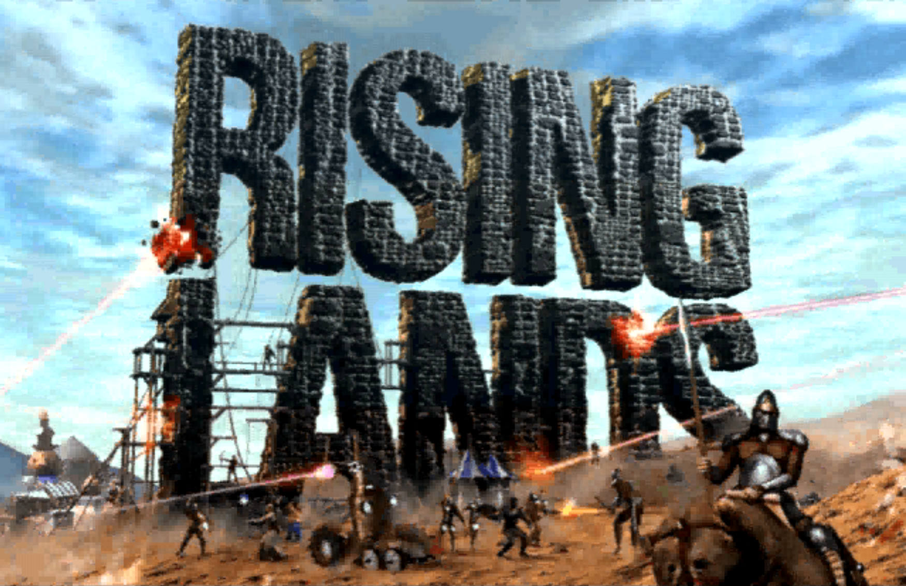
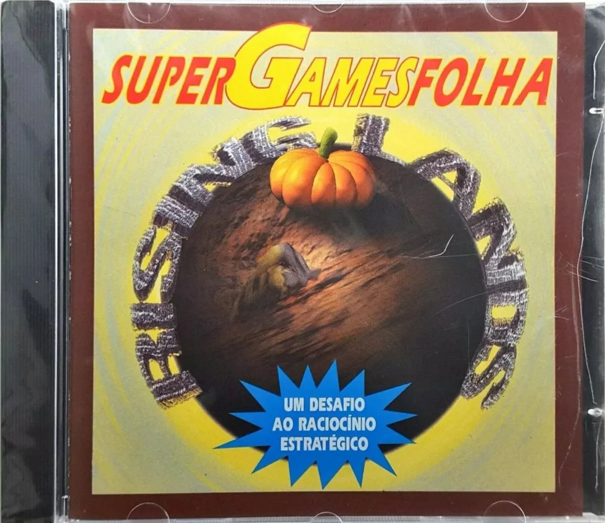
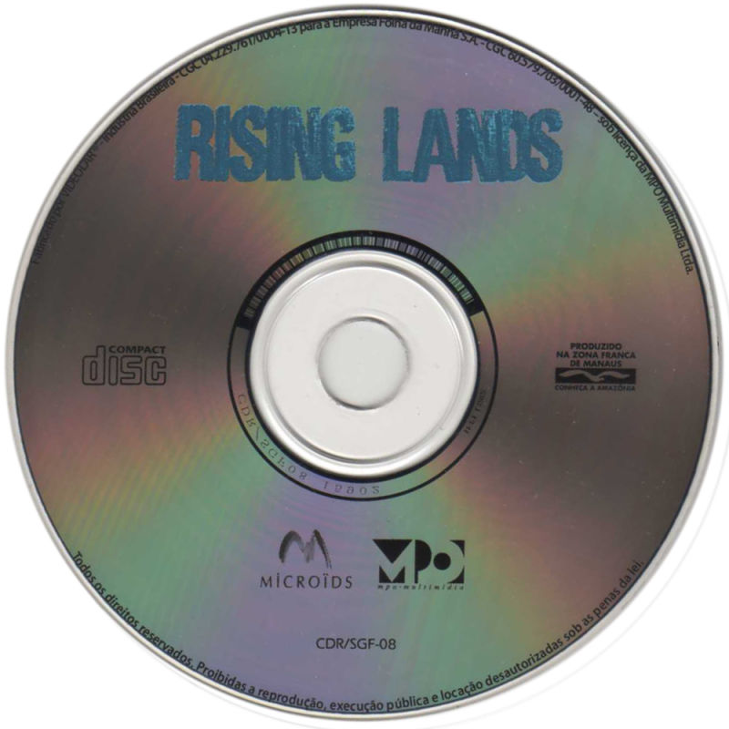
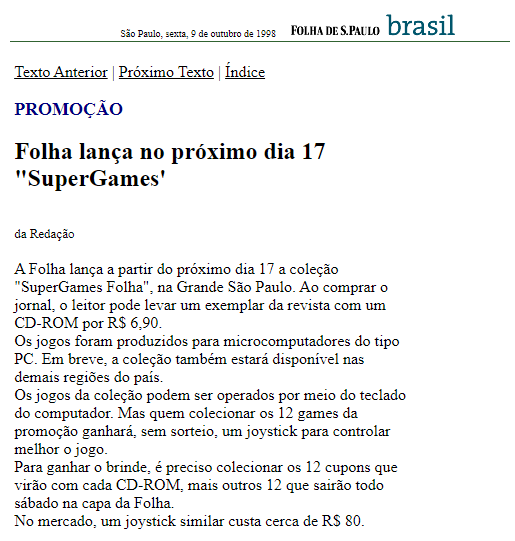
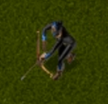

# Rising Lands

|  |
| :---------------------------------: |
|          **Rising Lands**           |

Rising Lands is a real-time strategy game developed by Microïds. The game was
released in 1997. It takes place in a not too distant future when Earth has been
devastated by a comet. The survivors formed tribes and you are the leader of one
of them. As you progress through the missions the general objective is to
advance your tribe to rule this new post-apocalyptical world.

<i> Rising Lands é um jogo de estratégia em tempo real desenvolvido pela
Microïds e lançado em 1997. O jogo se passa em um futuro não tão distante após o
choque de um meteoro com a Terra. Os sobreviventes formaram clãs e você é o
líder de um desses clãs. O objetivo ao longo das missões do jogo é avançar sua
tribo e dominar esse novo mundo pós-apocalíptico.</i>

|    |  |
| :-----------------------------------: | :---------------------------------: |
| **CD cover of the Brazilian version** |            **Actual CD**            |

I was just a kid when this came to Brazil. Rising Lands was one of the games
sold as part of this collection from Folha de São Paulo, a Brazilian newspaper.
I actually found this article from 1998 (original link
[here](https://www1.folha.uol.com.br/fsp/brasil/fc09109811.htm); in Portuguese)
talking about it. You would buy the newspaper and then for another R$ 6.90
(like a dollar or two today) you would get a CD. I think there were twelve in
total. If you collected all of them you would also get a joystick in the end. I
am pretty sure I still have it.

<i>Eu ainda era criança quando esse jogo veio para o Brasil. Rising Lands era
um dos jogos da coleção Supergames Folha. O artigo abaixo, de 1998, detalha um
pouco essa coleção (link original
[aqui](https://www1.folha.uol.com.br/fsp/brasil/fc09109811.htm)). A idéia era
que você comprasse o jornal e por mais R$ 6.90 levava também um CD.
Colecionando todos os doze jogos você ganhava um joystick, que eu provavelmente
ainda tenho em algum lugar.</i>

|         |
| :----------------------------------------: |
| **Article from 1998 about the collection** |

I spent a lot of time on this game, which is probably why I still like it.
Nothing like nostalgia. The graphics were ok, the game had a lot of nice
features and mechanics, but the UI and usability in general were cumbersome, to
say the least. I confess it took me maybe years to finally figure out how to
collect resources. At the time there was no manual in Portuguese explaining
things and I did not understand English. That never stopped me from having fun,
though. The best part were the units. Their lines were translated to Portuguese,
which made everything funnier and better. I still find myself repeating them out
loud. Yes, like 20 years later.

<i>Eu gastei muito da minha infância nesse jogo, fato que provavelmente explica
porque ainda gosto tanto. Nada como nostalgia. Os gráficos eram razoáveis, o
jogo em si tinha várias mecânicas legais, mas a interface e a usabilidade em
geral não eram dos melhores. Confesso que eu provavelmente demorei anos até
aprender a coletar recursos. Na época eu não tinha acesso a um manual em
português e eu não entendia nada de inglês. Contudo, nunca deixei de me
divertir com o jogo. A melhor parte eram as unidades: as falas eram traduzidas
para português e eram muito engraçadas. Ainda me pego repetindo as falas — sim,
20 anos depois.</i>

|  | <audio controls> <source src="https://raw.githubusercontent.com/nelsonspbr/nelsonspbr.github.io/master/games/rising/sounds/arqueiro-voce-chamou.mp3" type="audio/mp3"> </audio> |
| :---------------------------------: | :-----------------------------------------------------------------------------------------------------------------------------------------------------------------------------: |
|            **Arqueiro**             |                                                                                **Você chamou?**                                                                                 |

And that is it for introduction. In the other pages you will find more
information about the game, including how to [run it on modern
systems](./rising/run). Also, make sure to check my [YouTube
playlist](https://www.youtube.com/playlist?list=PLf2yslxcPQHn40RMAUIOJU_RiCwMdwBwY)
with all the game missions. Hope you enjoy it!

<i>E é isso pessoal. Nas outras páginas eu falo mais sobre o jogo, incluindo
instruções para [rodar o jogo em sistemas
modernos](./rising/run#rodando-em-sistemas-modernos). Ah, e não se esqueça de
dar uma olhada na minha [playlist no
YouTube](https://www.youtube.com/playlist?list=PLf2yslxcPQHn40RMAUIOJU_RiCwMdwBwY)
com as missões do jogo. Espero que vocês aproveitem!
