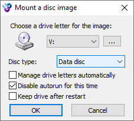

    <code>[</code>
    <a href="#running-on-modern-systems"><b>English</b></a>
    <code>|</code>
    <a href="#rodando-em-sistemas-modernos"><b>Português</b></a>
    <code>]</code>

# Running on Modern Systems

As you may already know, Rising Lands does not run well in modern systems. Even
if you make it work, chances are the game will run too fast to be playable.
There are fixes out there that might solve the issue, but it basically involves
replacing whatever game executable you have by a new one. And well, that might
ruin things, especially if you are running a version of the game in a different
language — as far as I am concerned, this fix is only available in English.

There is a solution, however, based on **dgVoodoo2**. This is a graphics wrapper
that converts old graphics to newer Direct3D versions — and that makes things
work in newer Windows versions, such as 7/8/10. You may read more about it
[here](https://github.com/dege-diosg/dgVoodoo2) and
[here](https://www.pcgamingwiki.com/wiki/DgVoodoo_2). For Rising Lands, that
allows us to configure **vSync** (Vertical Synchronization) which, as you might
have guessed, fixes the issue of the game running too fast by capping that speed
to the monitor's refresh rate.

This guide assumes the game is already installed — usually under `C:/RISING`. I
know... installing Rising Lands might be tricky enough, especially if you do not
have your CD anymore. I must say though, you may find it (in several different
languages) on [archive.org](https://archive.org). A quick Google search should
return what you are looking for.

## Instructions

1.  First, download the latest version of dgVoodoo2 from
    <a href="http://dege.freeweb.hu/dgVoodoo2/dgVoodoo2/" target="_blank">http://dege.freeweb.hu/dgVoodoo2/dgVoodoo2/</a>.
    Today, *Aug 20, 2021*, the current version is 2.75.1.

    |  |
    | :---------------------------------: |
    |        **dgVoodoo download**        |

2.  Extract the downloaded zip somewhere.

3.  Your `RISING` folder might look like this:

    |  |
    | :---------------------------------: |
    |         **`RISING` folder**         |

    Copy the following files from the extracted zip file from dgVoodoo into the
    `RISING` folder:

    - `MS/x86/D3D8.dll`
    - `MS/x86/D3DImm.dll`
    - `MS/x86/DDraw.dll`
    - `dgVoodooCpl.exe`

4.  Execute `dgVoodooCpl.exe`.

5.  Navigate to tab "DirectX" and mark option "Force vSync". Also, unmark option
    "dgVoodoo Watermark".

    |  |
    | :---------------------------------: |
    |         **dgVoodoo setup**          |

6.  Click "OK" and run `RISING.EXE`. This should be it!

## Troubleshooting

1.  <b>The game starts but the mission description is empty. I try to start the
    game and it crashes with an application error.</b>

    |  |
    | :---------------------------------: |
    |        **Application error**        |

    Make sure your CD can be found and read by the game, whether if it is in
    your CD drive (if you still have one) or mounted on your system.

2.  <b>How do I mount the CD image?</b>

    This is slightly outside the scope of this guide, but suffice to say that if
    you have an ISO or a CUE/BIN you may use a tool like **WinCDEmu** to mount
    it in your system. This creates a virtual CD drive that tricks your system
    into thinking you have a CD inserted. You may find WinCDEmu at
    https://wincdemu.sysprogs.org/. It is free and should not come with malware.

    |  |
    | :---------------------------------: |
    |            **WinCDEmu**             |

3.  <b>I cannot hear any music.</b>

    This, unfortunately, is expected and not simple to solve, especially if you
    are mounting the CD image. The solutions I am aware of are either having the
    CD in a proper CD drive or just playing the music from YouTube.

# Rodando em Sistemas Modernos

Como você já deve saber, Rising Lands não funciona bem em sistemas modernos.
Mesmo que você consiga instalar e rodar o jogo, provavelmente ele irá rodar
muito rápido, tornando impossível controlar unidades e afins. Existem versões
alteradas (fixes) do executável do jogo que resolvem o problema, contudo isso
exige que você basicamente troque a sua versão do jogo pelo fix. O problema é
que esses fixes (que eu saiba) existem apenas para a versão em inglês. Mesmo que
seu jogo seja em português, caso você instale esse fix o idioma será trocado — e
aí não tem graça.

Felizmente existe uma solução baseada em dgVoodoo2, uma biblioteca que converte
gráficos antigos em versões mais recentes de Direct3D. Isso faz com que jogos
antigos passem a funcionar em versões mais novas de Windows, como 7/8/10. Tem
mais informações sobre essa biblioteca
[aqui](https://github.com/dege-diosg/dgVoodoo2) e
[aqui](https://www.pcgamingwiki.com/wiki/DgVoodoo_2). No caso de Rising Lands
isso permite que a gente configure o **vSync** (sincronização vertical), que faz
com que o jogo rode na mesma velocidade do monitor — efetivamente resolvendo o
problema do jogo rodar rápido demais.

Esse guia assume que o jogo já está instalado — tipicamente em `C:/RISING`. Sim,
instalar o jogo já pode ser suficientemente complicado, especialmente se você
não tem mais o CD do jogo. Contudo, vale destacar que é possível encontrar o CD
no [archive.org](https://archive.org) — inclusive em português!

## Instruções

1.  Primeiro, baixe a versão mais recente do dgVoodoo disponível em
    <a href="http://dege.freeweb.hu/dgVoodoo2/dgVoodoo2/" target="_blank">http://dege.freeweb.hu/dgVoodoo2/dgVoodoo2/</a>.
    Hoje, dia 20 de agosto de 2021, a última versão é 2.75.1.

    |  |
    | :---------------------------------: |
    |      **Download do dgVoodoo**       |

2.  Extraia o zip em alguma pasta do seu sistema.

3.  Sua pasta `RISING` provavelmente parece com isso:

    |  |
    | :---------------------------------: |
    |         **Pasta `RISING`**          |

    Copie os seguintes arquivos do zip extraído para a pasta `RISING`:

    - `MS/x86/D3D8.dll`
    - `MS/x86/D3DImm.dll`
    - `MS/x86/DDraw.dll`
    - `dgVoodooCpl.exe`

4.  Execute o programa `dgVoodooCpl.exe`.

5.  Navegue até a aba "DirectX" e marque a opção "Force vSync". Além disso,
    desmarque a opção "dgVoodoo Watermark".

    |  |
    | :---------------------------------: |
    |    **Configuração da dgVoodoo**     |

6.  Clique em "OK" e rode o jogo, `RISING.EXE`. Pronto, isso deve servir!

## Resolução de Problemas

1.  <b>O jogo inicia mas a descrição das missões está vazia. Eu tento iniciar o
    jogo e ele termina sozinho com uma mensagem de erro.</b>

    |  |
    | :---------------------------------: |
    |        **Erro de aplicação**        |

    Certifique-se de que o CD do jogo pode ser encontrado e lido, seja o CD
    físico no drive ou montado no seu sistema.

2.  <b>Como eu monto uma imagem de CD?</b>

    Isso é um pouco fora do escopo desse guia, mas se você tem um arquivo ISO ou
    CUE/BIN você pode usar uma ferramenta como o **WinCDEmu** para montar a
    imagem no sistema. Isso cria um drive virtual que faz com que o sistema
    pense que existe um CD inserido. Você pode encontrar o WinCDEmu em
    https://wincdemu.sysprogs.org/. É gratuito e não costuma vir com malware;
    para garantir, baixe diretamente do site do desenvolvedor.

    |  |
    | :---------------------------------: |
    |            **WinCDEmu**             |

3.  <b>O jogo está sem música.</b>

    Isso infelizmente acontece mesmo, especialmente se você está apenas montando
    o CD. A solução mais simples é jogar com o CD físico ou tocar a música a
    partir do YouTube, por exemplo.
