# Unidades
{: .no_toc }

Esta página descreve as unidades de Rising Lands.

--------------------------------------------------------------------------------

  

    Contents
  

  {: .text-delta }
1. TOC
{:toc}



--------------------------------------------------------------------------------

## Civis

As unidades civis formam a base econômica para o crescimento do clã, e são
responsáveis acúmulo de recursos necessários para treinamento de novas unidades
e expansão de suas bases. Contudo, por serem unidades desarmadas (e frágeis),
devem ser constantemente protegidas por outras unidades militares.

### Colono

| 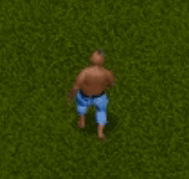 |
| :--------------------------: |
|            Colono            |

> COLONIZADOR
>
> Unidade Civil
> Custo	Comida:5	Visão: 5/10
> Ferramentas: nenhuma (talvez uma vassoura...)
> Papel: ocupar edifícios, ser treinado.
> Recrutamento: Cultura
>
> A VIDA DE UM COLONIZADOR
>
> Um itinerante, o Colonizador aguarda até ser recrutado. Indolente e preguiçoso por
> natureza, ele gosta acima de tudo de deitar em sua rede embaixo do sol e tirar uma
> longa soneca. Após ser tratado com indulgência pelo recrutador, ele acha difícil se
> encaixar na sua nova posição. Suas opções: treinamento, ou se tornar um zelador.... Essa
> mudança radical toca-o profundamente, a tal ponto de levá-lo a refugiar-se no sono, o
> que ele faz mais do que qualquer outra coisa. Considerado divertido pelos companheiros,
> ele não gosta que zombem dele e espera um dia recuperar sua liberdade perdida. Ele é
> um incansável viajante e ama dirigir veículos motorizados e esmagar inimigos, esperando
> através disto alcançar algum tipo de reconhecimento.
>
> — *manual do jogo*

O Colono é a unidade fundamental do jogo, a partir da qual todas as outras (com
exceção das unidades aéreas) são treinadas. A mecânica de recrutamento de novos
colonos é discutida com maior amplitude [aqui](./gameplay#população). Vale
ressaltar a importância de ter uma cadência saudável de criação de novos Colonos
para que sua economia (e seu exército) possam crescer de acordo com a demanda.
Também vale destacar a necessidade de tomar cuidado para não converter todos os
Colonos em outras unidades, caso contrário não é possível recrutar mais Colonos.

### Fazendeiro

| 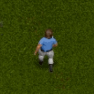 |
| :----------------------------------: |
|              Fazendeiro              |

### Mecânico

| 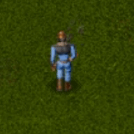 |
| :------------------------------: |
|             Mecânico             |

### Construtor

| 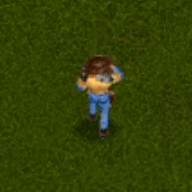 |
| :----------------------------------: |
|              Construtor              |

### Mensageiro

|  |
| :----------------------------------: |
|              Mensageiro              |

## Infantaria

### Soldado

| 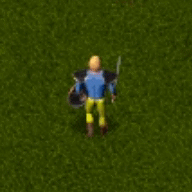 |
| :----------------------------: |
|            Soldado             |

### Incendiário

| 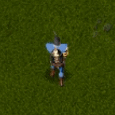 |
| :------------------------------------: |
|              Incendiário               |

### Arqueiro

| 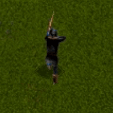 |
| :------------------------------: |
|             Arqueiro             |

### Capitão

| 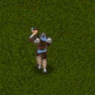 |
| :----------------------------: |
|            Capitão             |

## Cavalaria

Ou, como mencionado no manual do jogo, "unidades animais",

### Dell'Orso

| 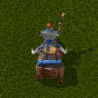 |
| :------------------------------: |
|            Dell'Orso             |

### Rhino

| 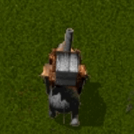 |
| :------------------------: |
|           Rhino            |

## Mecânicas

### Speeder

| 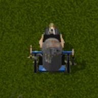 |
| :----------------------------: |
|            Speeder             |

### Bunker

| 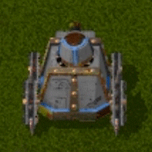 |
| :--------------------------: |
|            Bunker            |

### Ceifeiro

| 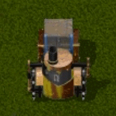 |
| :------------------------------: |
|             Ceifeiro             |

### Bombardeiro

| 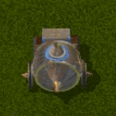 |
| :------------------------------------: |
|              Bombardeiro               |

### Sun

| 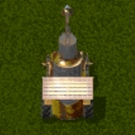 |
| :--------------------: |
|          Sun           |

## Mágicas

### Druida

| 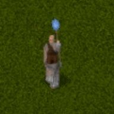 |
| :--------------------------: |
|            Druida            |

## Aéreas

### Balão

|  |
| :-----------------------------: |
|              Balão              |

### Helicóptero

| 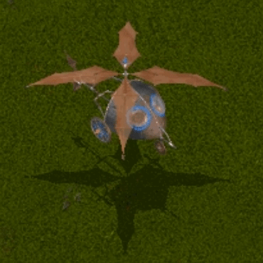 |
| :-----------------------------------------: |
|                 Helicóptero                 |

## Criaturas das Sombras

### Raptor

| 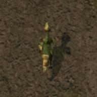 |
| :--------------------------: |
|            Raptor            |

### Bukka

| 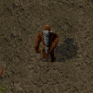 |
| :------------------------: |
|           Bukka            |

### Lançador

| 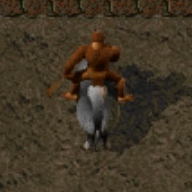 |
| :------------------------------: |
|             Lançador             |

### Esmagador

| 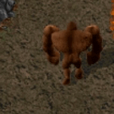 |
| :--------------------------------: |
|             Esmagador              |

### Estalador

| 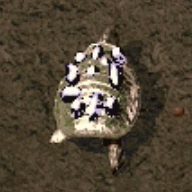 |
| :--------------------------------: |
|             Estalador              |
